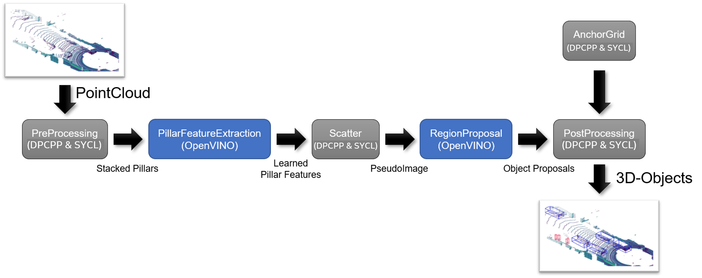
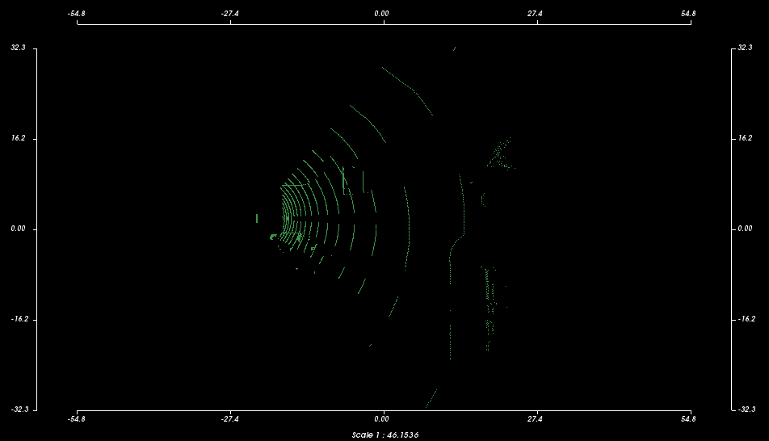

# Lidar Object Detection framework PointPillars using OpenCL and OpenVINO
The repository is the implementation of  `Lidar Object Detection framework PointPillars` using OpenCL and OpenVINO, similar to [LidarObjectDetection-PointPillars based on SYCL in OneAPI-samples](https://github.com/oneapi-src/oneAPI-samples/tree/master/AI-and-Analytics/End-to-end-Workloads/LidarObjectDetection-PointPillars). This implementation is ideal for Intel devices.



1. The LiDAR input point cloud is pre-processed with the help of kernels implemented using OpenCL.
2. Using OpenCL, the sample generates an anchor grid. The anchors in the grid are used in object detection to refine detected boxes by the Region Proposal Network (RPN).
3. A Pillar Feature Extraction (PFE) Convolutional Neural Network (CNN) uses the pre-processed data to create a 2D image-like representation of the sensor environment. For the inference, this sample uses the Intel® Distribution of OpenVINO™ toolkit. The output of this CNN is a list of dense tensors, or learned pillar features.
4. Using OpenCL, the sample performs a scatter operation to convert these dense tensors into a pseudo-image.
5. A second CNN, Region Proposal Network (RPN), consumes the pseudo-image. The inference is performed with the help of the Intel® Distribution of OpenVINO™ toolkit. The output is an unfiltered list of possible object detections, their position, dimensions, and classifications.
6. Using OpenCL kernels, the output data (object list) is post-processed with the help of the anchors created earlier in Step 2. The anchors are used to decode the object position, dimension, and class. A Non-Maximum-Suppression (NMS) is used to filter out redundant/clutter objects.
7. Using OpenCL kernels, the objects are sorted according to likelihood and provided as output.

## Prerequisites

| Optimized for                     | Description
|:---                               |:---
| OS                                | Ubuntu* 16.04
| Hardware                          | Skylake with GEN8 (or newer) 
| Software                          | Intel® Distribution of OpenVINO™ toolkit (2022.1 or newer)

## Build this project

1. Build the OpenCL dependencies
```
cd /tmp
git clone --recursive https://github.com/KhronosGroup/OpenCL-SDK.git
cd OpenCL-SDK && mkdir build && cd build
cmake .. -DBUILD_DOCS=OFF -DBUILD_EXAMPLES=OFF -DBUILD_TESTING=OFF -DOPENCL_SDK_BUILD_OPENGL_SAMPLES=OFF -DOPENCL_SDK_TEST_SAMPLES=OFF -DOPENCL_SDK_BUILD_SAMPLES=OFF -DCMAKE_INSTALL_PREFIX=$HOME/local
make install
```
1. Change to the sample directory.
2. Build the program.
   ```
   mkdir build && cd build
   cmake .. -DCMAKE_PREFIX_PATH=$HOME/local
   make
   ```

If an error occurs, you can get more details by running `make` with the
`VERBOSE=1` argument:
 ```
 make VERBOSE=1
 ```

## Example Output

The input data for the sample program is the `example.pcd` file located in the **/data** folder. It contains an artificial point cloud from a simulated LIDAR sensor from [CARLA Open-source simulator for autonomous driving research](http://carla.org/). 

This image shows the corresponding scene.


There are three cars in this scene, one of which is far away and is not yet properly covered in the LIDAR scan. There is a black car in the intersection, which is also visible in the LIDAR data, and a car behind the black one, which is hidden. The sample code should detect at least one car.

The `example.pcd` file is a point cloud in ASCII using the PCL-format, which renders something similar to the following in the Point Cloud Viewer (pcl_viewer) tool.



Using the data provided in the sample, the program should detect at least one object.

```
Starting PointPillars
   PreProcessing - 20ms
   AnchorMask - 10ms
   PFE Inference - 91ms
   Scattering - 50ms
   RPN Inference - 107ms
   Postprocessing - 13ms
Done
Execution time: 296ms

1 cars detected
Car: Probability = 0.622569 Position = (24.8561, 12.5615, -0.00771689) Length = 2.42855 Width = 3.61396
```

